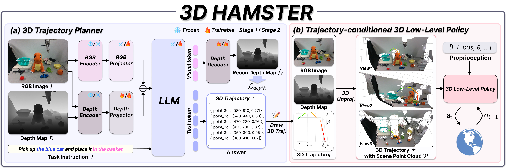

<div align="center">

# 3D HAMSTER : Bridging Planning and Control in Hierarchical Vision Language Action Models through <br> 3D Trajectory Guidance

[](https://arxiv.org/abs/2606.31329)
[](https://davian-robotics.github.io/3D_HAMSTER/)
[](https://github.com/DAVIAN-Robotics/3D_HAMSTER)
[](https://huggingface.co/DAVIAN-Robotics/3D_HAMSTER)
[](LICENSE)

Dongyoon Hwang<sup>\*1</sup>, Byungkun Lee<sup>\*1</sup>, Dongjin Kim<sup>\*1</sup>, Hyojin Jang<sup>1</sup>, Hoiyeong Jin<sup>1</sup>, Jueun Mun<sup>2</sup>, \
 Minho Park<sup>1</sup>, Hojoon Lee<sup>3</sup>, Hyunseung Kim<sup>1,4</sup>, Jaegul Choo<sup>†1</sup>

<sup>1</sup>KAIST AI &nbsp;&nbsp; <sup>2</sup>POSTECH &nbsp;&nbsp; <sup>3</sup>Holiday Robotics &nbsp;&nbsp; <sup>4</sup>KRAFTON AI

<sup>\*</sup>Equal contribution &nbsp;&nbsp; <sup>†</sup>Corresponding author

**🎉 Accepted to IROS 2026** — IEEE/RSJ International Conference on Intelligent Robots and Systems

</div>

---

> **TL;DR** — 3D HAMSTER is a depth-aware VLM planner that predicts **metrically grounded 3D end-effector trajectories** directly from a single RGB-D observation and a language instruction. Unlike 2D planners whose pixel waypoints inherit whatever depth lies beneath them, 3D HAMSTER plans in metric 3D space, so the trajectory stays geometrically grounded and can feed straight into a point-cloud low-level policy.

<div align="center">
  
</div>

**This repository** provides **inference-only** code for the 3D HAMSTER **VLM planner** — loading the released checkpoint, running trajectory prediction on RGB-D inputs, and a Gradio demo. (The low-level point-cloud policy is part of the full system described in the paper and is not included here.)

## Highlights

- **Input:** a single RGB image + a metric depth map + a language instruction.
- **Output:** a metric 3D end-effector trajectory as `[u, v, depth]` waypoints (pixel coordinates + metric depth in meters) plus gripper actions, in structured JSON.
- **Backbone:** Qwen3-VL-8B augmented with a frozen **LingBot-Depth** geometry encoder (DINOv2 ViT-L/14) and a dense depth-reconstruction objective.
- **Self-contained:** `pip install` this package, download the checkpoint, and run. The geometry-encoder code is vendored in-repo and its weights ship inside the checkpoint — **no separate model download and no network access at load time.**

## Installation

```bash
# 1. Create and activate an environment (Python >= 3.10)
conda create -n 3d_hamster python=3.11 -y
conda activate 3d_hamster

# 2. Clone and install (pulls in the vendored LingBot-Depth encoder code)
git clone https://github.com/DAVIAN-Robotics/3D_HAMSTER.git
cd 3D_HAMSTER
pip install -e .
```

Optional extra — `pip install -e ".[perf]"` adds xformers (faster attention; matches the reference setup, falls back to an equivalent path when absent).

## Model Weights

The checkpoint is hosted on the Hugging Face Hub at
[**`DAVIAN-Robotics/3D_HAMSTER`**](https://huggingface.co/DAVIAN-Robotics/3D_HAMSTER) —
a single self-contained checkpoint (9B, bf16) that bundles the Qwen3-VL LLM, the
vision encoder, the geometry merger, **and** the frozen LingBot-Depth encoder weights.

```bash
# Download into ./ckpt
hf download DAVIAN-Robotics/3D_HAMSTER --local-dir ckpt
```

## Quickstart — 3D Trajectory Prediction (Python API)

By default, `Hamster3DPredictor` performs **3D trajectory prediction**: from a single RGB-D
observation and a language instruction it returns a metric 3D end-effector trajectory as
`[u, v, depth]` waypoints with per-waypoint gripper actions.

```python
from hamster3d.inference import Hamster3DPredictor
import numpy as np
from PIL import Image

predictor = Hamster3DPredictor("ckpt/")        # device="cuda:0", bf16 by default

rgb = Image.open("examples/sample_0_rgb.png")
depth = np.load("examples/sample_0_depth.npy")          # float32, meters, shape (H, W)
instruction = open("examples/sample_0_instruction.txt").read().strip()

result = predictor.predict(rgb, depth, instruction)     # 3D trajectory prediction

print(result["waypoints"])   # [[u, v, depth], ...]  pixel u,v (0-1000) + metric depth (m)
print(result["actions"])     # ["Close Gripper", None, ..., "Open Gripper"]
print(result["raw_output"])  # raw structured-JSON string from the model
```

Six ready-to-run examples ship in [`examples/`](examples/) (`sample_0` … `sample_5`), each with an RGB image, a depth `.npy`, an instruction, and the camera intrinsics (`*_camera.json`).

### Input / Output specification

| | Format |
|---|---|
| **RGB** | `PIL.Image` (any resolution; auto-resized so the longest edge is 640 px) |
| **Depth** | `np.ndarray`, `float32`, shape `(H, W)`, **metric depth in meters** (e.g. `0.26 – 9.99`). Must be aligned to the RGB frame. |
| **Instruction** | free-form English string |
| **Output** | `dict` with `waypoints` (`[[u, v, depth], ...]` — 3D trajectory), `actions` (gripper action or `None` per waypoint), `raw_output` (raw structured-JSON string), and the resized `rgb_resized` / `depth_resized` arrays |

`predict()` also accepts `max_new_tokens` (default 1024). The Python API is dedicated to **3D trajectory prediction**; for the other task styles, use the Gradio demo below.

The **Gradio demo** exposes all task styles via a dropdown (each sends the matching prompt and renders the result):

| Task style | Output | Visualization |
|---|---|---|
| **3D Trajectory** (default) | `point_3d` waypoints `[u, v, depth]` + gripper | 2D overlay + 3D scene path |
| **2D Trajectory** | `point_2d` waypoints `[u, v]` + gripper | 2D overlay |
| **3D Pointing** | `point_3d` points `[u, v, depth]` | numbered dots + 3D scene markers |
| **2D Pointing** | `point_2d` points `[u, v]` | numbered dots |
| **2D Bounding Box** | `bbox_2d` `[x1, y1, x2, y2]` | boxes |
| **General VQA** | free-form text | answer text |

> ⚠️ Depth must be **metric (meters)** and aligned to the RGB image. Passing disparity, normalized, or millimeter-scaled depth will silently degrade the predicted geometry.

## Gradio Demo

```bash
CUDA_VISIBLE_DEVICES=0 python scripts/trajectory_prediction_gradio.py --autoload
```

Open the **Examples Browser** tab to run the bundled `examples/` (or use **Manual Inference** to upload your own RGB + depth): pick a sample, set the task instruction / prompt style, and inspect the predicted 2D trajectory, the 3D trajectory, and the full conversation.

## Acknowledgments & Licensing

3D HAMSTER builds on several open-source projects:

- **[Qwen3-VL](https://github.com/QwenLM/Qwen3-VL)** — the base vision-language model.
- **[LingBot-Depth](https://github.com/robbyant/lingbot-depth)** (Robbyant, Apache-2.0) — the
  metric-depth geometry encoder. Its encoder **code is vendored** in this repo under
  [`hamster3d/lingbot_depth/`](hamster3d/lingbot_depth/) (unmodified; see its
  [`LICENSE`](hamster3d/lingbot_depth/LICENSE)), and its frozen **weights** are bundled inside
  the released checkpoint. Original model: [`robbyant/lingbot-depth-pretrain-vitl-14`](https://huggingface.co/robbyant/lingbot-depth-pretrain-vitl-14).
- **[DINOv2](https://github.com/facebookresearch/dinov2)** (Meta AI, Apache-2.0) — the backbone of the LingBot-Depth encoder.

This repository is released under the **Apache License 2.0** (see [LICENSE](LICENSE)). The
bundled LingBot-Depth and DINOv2 components are themselves Apache-2.0; their licenses and
attributions are retained and apply to the corresponding code and weights.

## Citation

If you find 3D HAMSTER useful, please cite our work:

```bibtex
@INPROCEEDINGS{hwang20263dhamster,
  author={Hwang, Dongyoon and Lee, Byungkun and Kim, Dongjin and Jang, Hyojin and Jin, Hoiyeong and Mun, Jueun and Park, Minho and Lee, Hojoon and Kim, Hyunseung and Choo, Jaegul},
  booktitle={2026 IEEE/RSJ International Conference on Intelligent Robots and Systems (IROS)},
  title={{3D HAMSTER}: Bridging Planning and Control in Hierarchical Vision Language Action Models through {3D} Trajectory Guidance},
  year={2026}}
```